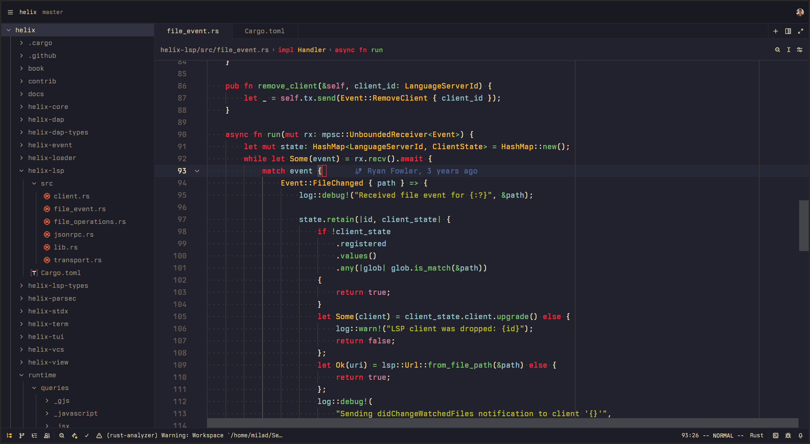
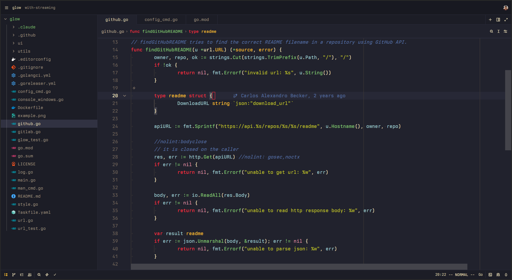
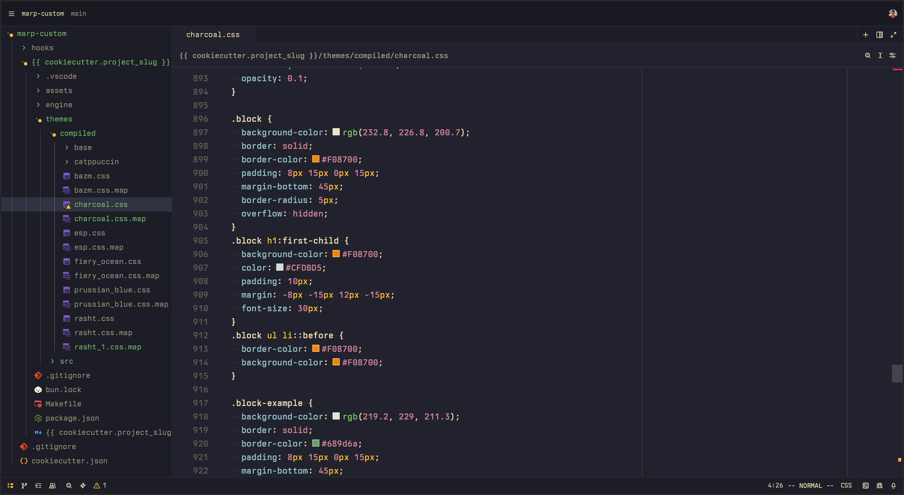

# Popping and Locking

A dark theme for [Zed](https://zed.dev) with vibrant colors inspired by Gruvbox.

Originally created by [Hedinn Eiriksson](https://github.com/hedinne/popping-and-locking-vscode) for VS Code.

## Screenshots

## Installation

1. Open Zed
2. Open the command palette
3. Search for "zed: extensions"
4. Search for "Popping and Locking Theme" and install
